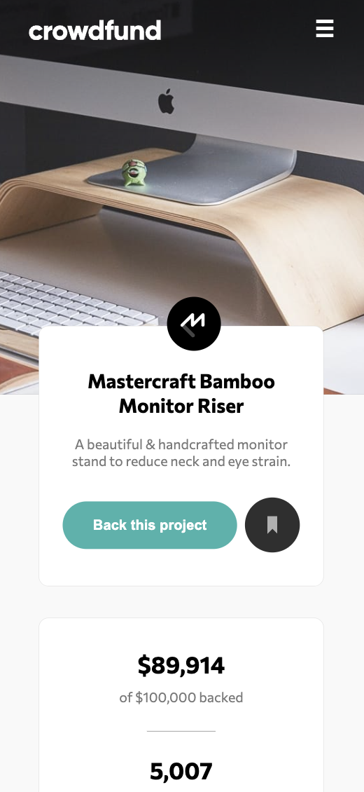
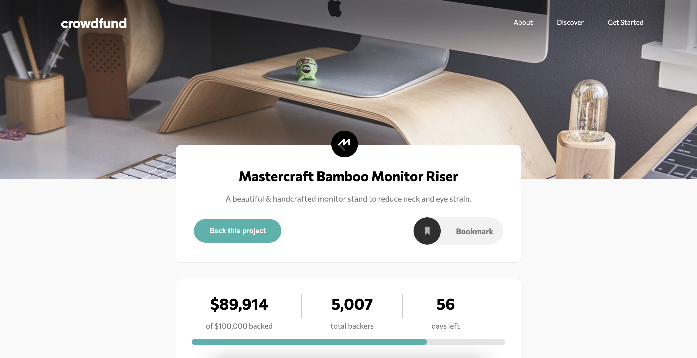

# Frontend Mentor - Crowdfunding product page solution

This is a solution to the [Crowdfunding product page challenge on Frontend Mentor](https://www.frontendmentor.io/challenges/crowdfunding-product-page-7uvcZe7ZR). Frontend Mentor challenges help you improve your coding skills by building realistic projects. 

## Table of contents

- [Overview](#overview)
  - [The challenge](#the-challenge)
  - [Screenshot](#screenshot)
  - [Links](#links)
- [My process](#my-process)
  - [Built with](#built-with)
  - [What I learned](#what-i-learned)
  - [Continued development](#continued-development)
  - [Useful resources](#useful-resources)
- [Author](#author)


## Overview

### The challenge

Users should be able to:

- View the optimal layout depending on their device's screen size
- See hover states for interactive elements
- Make a selection of which pledge to make
- See an updated progress bar and total money raised based on their pledge total after confirming a pledge
- See the number of total backers increment by one after confirming a pledge
- Toggle whether or not the product is bookmarked

### Screenshot





### Links

- Solution URL: [Github](https://github.com/michaelr47/Crowdfunding-ProductPage)
- Live Site URL: [Crowdfunding Page](https://michaelr47.github.io/Crowdfunding-ProductPage/)

## My process

### Built with

- Mobile-first workflow
- Semantic HTML5 markup
- CSS custom properties
- Flexbox
- Vanilla JS - no frameworks
- Functional Programming 

### What I learned
I learned a new css property which I was able to change the color of the radio checked which I thought was cool and neat.

```css
.bookmark { filter: invert(34%) sepia(74%) saturate(446%) hue-rotate(127deg) brightness(98%) contrast(94%); }
```

This resize event allowed me to display or not display the hamburger icon. Originally I was thinking of creating a function ON PAGE LOAD if page width is 768px or higher, then display nav menu OR if it was less than 768px, display hamburger icon. This resizing event is much better in this case. 
```js
window.addEventListener('resize', () => {
    let hamburger = document.querySelector('.hamburger');
    let windowSizeX = window.innerWidth;
    
    if (windowSizeX > 768) {
        hamburger.style.display = 'none';

    } else {
        hamburger.style.display = 'block';
    }
})
```
### Continued development

This was the first ever real project that I implemented the mobile first design and onwards to tablet and desktop. I will say its was pretty hard styling the css design for mobile first but gradually, I was getting into the rhythm of it and felt super easier than the other way around (Desktop to mobile). I will continue to implement mobile first designs 😀.

### Useful resources

- [MDN css filter](https://developer.mozilla.org/en-US/docs/Web/CSS/filter) - This allowed me to play around with it and was able to generate the correct color that I wanted for the radio button.

## Author

- GitHub - [@michaelr47](https://github.com/michaelr47)
- Frontend Mentor - [@michaelr47](https://www.frontendmentor.io/profile/michaelr47)
